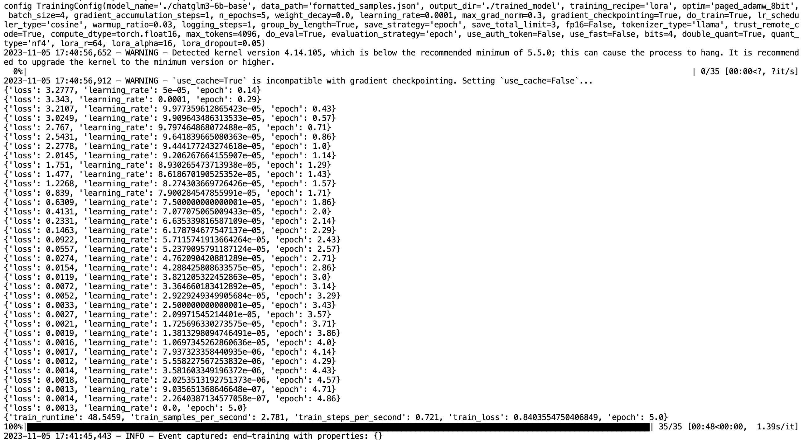
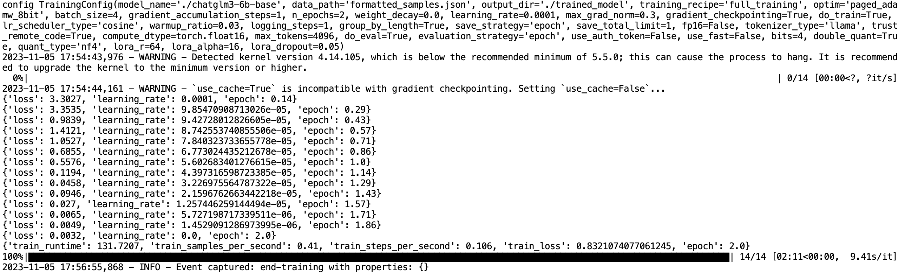

# chatglm3-base-tuning：基础模型微调

## 介绍

chatglm3发布了，这次还发了base版本的模型，意味着我们可以基于这个base模型去自由地做SFT了。本项目实现了基于base模型的SFT。

- 支持Lora微调和全参数微调


## base模型

```text
https://huggingface.co/THUDM/chatglm3-6b-base
```

由于模型较大，建议离线下载后放在代码目录，以"./chatglm3-6b-base"的路径进行调用。

## 环境依赖

```text
pip install protobuf transformers==4.30.2 peft cpm_kernels torch>=2.0 gradio mdtex2html sentencepiece accelerate
```

除了transformers，其他库的版本一般问题不大，遇到缺失的直接pip install即可。

## SFT数据格式

使用自己的数据可以参照formatted_samples.json文件，这里没有考虑system，实际使用可以根据自己的情况加上，需要修改chat_data_module.py中对应的数据处理部分。

附上chatglm3的prompt格式 

```text
<|system|>
You are ChatGLM3, a large language model trained by Zhipu.AI. Follow the user's instructions carefully. Respond using markdown.
<|user|>
Hello
<|assistant|>
Hello, I'm ChatGLM3. What can I assist you today?
```

**其实数据处理chat_data_module.py中会拼接一些token就是拼接user、assistant、换行等特殊token**

## SFT的方式

假设SFT的数据为 
```text
Q1,A1,Q2,A2,Q3,A3
```
SFT的过程只会计算
```text
A1,A2,A3
```
的loss，且一次推理会同时计算多轮对话的loss。


## 如何微调

如果模型路径为"./chatglm3-6b-base"，直接

```text
python train.py
```

就可以运行。train.py 当中有需要可调节的参数可以自行调整。

#### Lora微调



#### 全参数微调



因为数据量太少，可以看到全参数微调一开始loss就在波动，而且很容易过拟合。

## 微调效果

作为没有经过人类意图对齐的模型，ChatGLM3-6B-Base 不能用于多轮对话。但是可以进行文本续写。

这里仅通过27条数据进行SFT，发现模型就能够具有一定的对话能力了。

导入模型并合并

```python
from transformers import AutoTokenizer, AutoModel
from peft import LoraConfig, PeftModel, get_peft_model

tokenizer = AutoTokenizer.from_pretrained("./chatglm3-6b-base", trust_remote_code=True)
model = AutoModel.from_pretrained("./chatglm3-6b-base", trust_remote_code=True).half().cuda()

peft_model_id = './trained_model/checkpoint-35'
model = PeftModel.from_pretrained(model, peft_model_id)
```


    Loading checkpoint shards:   0%|          | 0/7 [00:00<?, ?it/s]

如果是全参数微调不需要合并模型 ，但记得把chatglm里的代码文件copy到微调后的路径中

```
from transformers import AutoTokenizer, AutoModel
from peft import LoraConfig, PeftModel, get_peft_model

tokenizer = AutoTokenizer.from_pretrained("./chatglm3-6b-base", trust_remote_code=True)
model = AutoModel.from_pretrained("./trained_model/checkpoint-14", trust_remote_code=True).half().cuda()

# peft_model_id = './trained_model/checkpoint-35'
# model = PeftModel.from_pretrained(model, peft_model_id)
```

开始对话

```python
history = []
query = "你是谁"
role = "user"
inputs = tokenizer.build_chat_input(query, history=history, role=role)
inputs = inputs.to('cuda')
eos_token_id = [tokenizer.eos_token_id, tokenizer.get_command("<|user|>"),
                        tokenizer.get_command("<|observation|>")]
gen_kwargs = {"max_length": 500, "num_beams": 1, "do_sample": True, "top_p": 0.8,
                      "temperature": 0.8}
outputs = model.generate(**inputs, **gen_kwargs, eos_token_id=eos_token_id)
outputs = outputs.tolist()[0][len(inputs["input_ids"][0]):-1]
response = tokenizer.decode(outputs)
history = []
history.append({"role": "user", "content": "你是谁"})
response, history = model.process_response(response, history)
print(response)
```

    我叫MONY，是一个AI机器人。


```python
query = "你能干嘛呀"
role = "user"
inputs = tokenizer.build_chat_input(query, history=history, role=role)
inputs = inputs.to('cuda')
outputs = model.generate(**inputs, **gen_kwargs, eos_token_id=eos_token_id)
outputs = outputs.tolist()[0][len(inputs["input_ids"][0]):-1]
response = tokenizer.decode(outputs)
history.append({"role": role, "content": query})
response, history = model.process_response(response, history)
print(response)
```

    我能够陪你聊天呀。


```python
query = "你认识乐乐吗"
role = "user"
inputs = tokenizer.build_chat_input(query, history=history, role=role)
inputs = inputs.to('cuda')
outputs = model.generate(**inputs, **gen_kwargs, eos_token_id=eos_token_id)
outputs = outputs.tolist()[0][len(inputs["input_ids"][0]):-1]
response = tokenizer.decode(outputs)
history.append({"role": role, "content": query})
response, history = model.process_response(response, history)
print(response)
```

    我不认识乐乐。


```python
query = "可以夸一下乐乐长得好看吗"
role = "user"
inputs = tokenizer.build_chat_input(query, history=history, role=role)
inputs = inputs.to('cuda')
outputs = model.generate(**inputs, **gen_kwargs, eos_token_id=eos_token_id)
outputs = outputs.tolist()[0][len(inputs["input_ids"][0]):-1]
response = tokenizer.decode(outputs)
history.append({"role": role, "content": query})
response, history = model.process_response(response, history)
print(response)
```

    乐乐听起来是一个人名，我不认识他。


```python
query = "你要夸她长得好看"
role = "user"
inputs = tokenizer.build_chat_input(query, history=history, role=role)
inputs = inputs.to('cuda')
outputs = model.generate(**inputs, **gen_kwargs, eos_token_id=eos_token_id)
outputs = outputs.tolist()[0][len(inputs["input_ids"][0]):-1]
response = tokenizer.decode(outputs)
history.append({"role": role, "content": query})
response, history = model.process_response(response, history)
print(response)
```

    好的，我会记住的。


```python
query = "你倒是夸一下呀"
role = "user"
inputs = tokenizer.build_chat_input(query, history=history, role=role)
inputs = inputs.to('cuda')
outputs = model.generate(**inputs, **gen_kwargs, eos_token_id=eos_token_id)
outputs = outputs.tolist()[0][len(inputs["input_ids"][0]):-1]
response = tokenizer.decode(outputs)
history.append({"role": role, "content": query})
response, history = model.process_response(response, history)
print(response)
```

    乐乐是一个很可爱的人。


## References

代码参考自llamatune项目

https://github.com/havenhq/haven/tree/dev/llamatune


